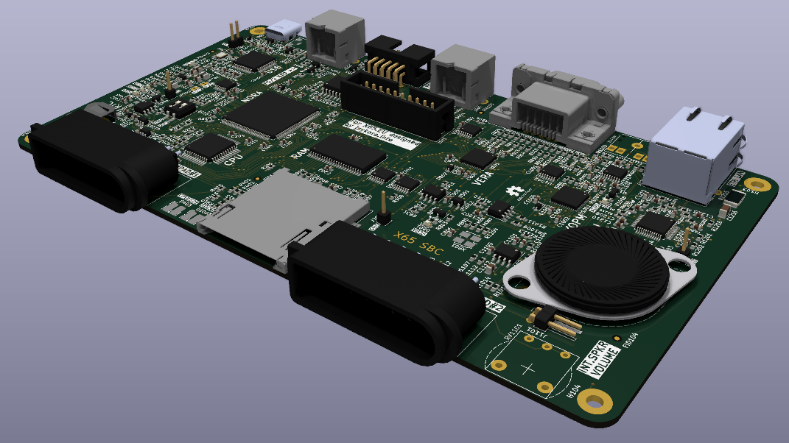
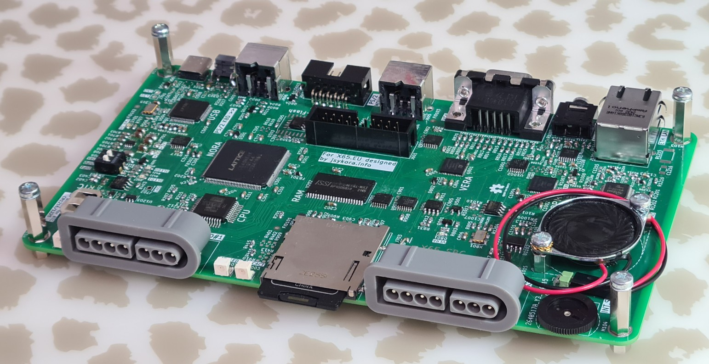
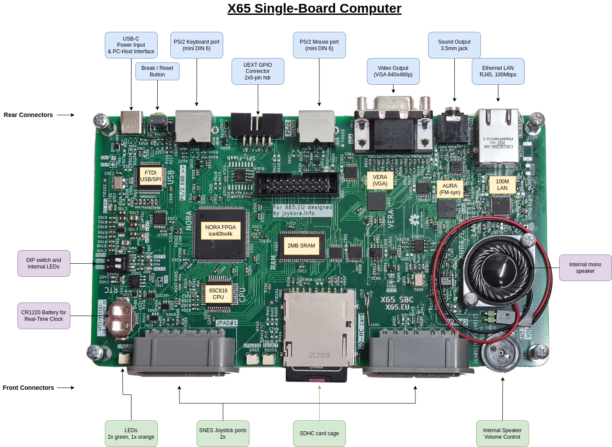
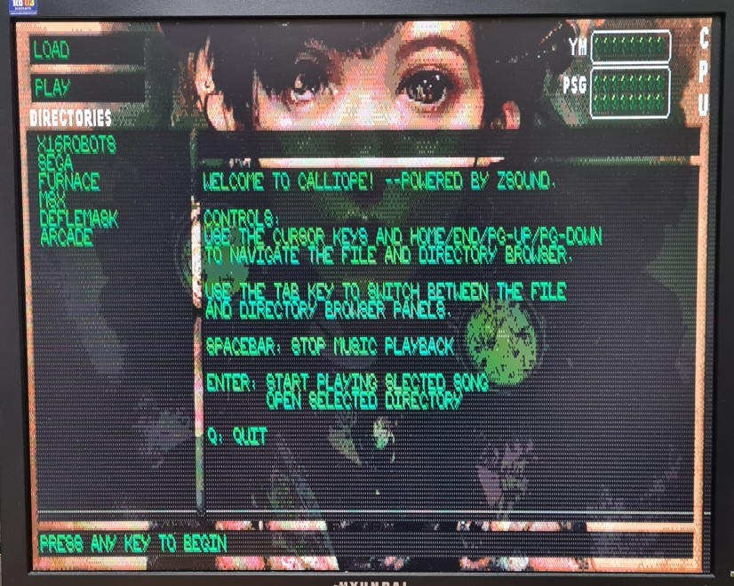
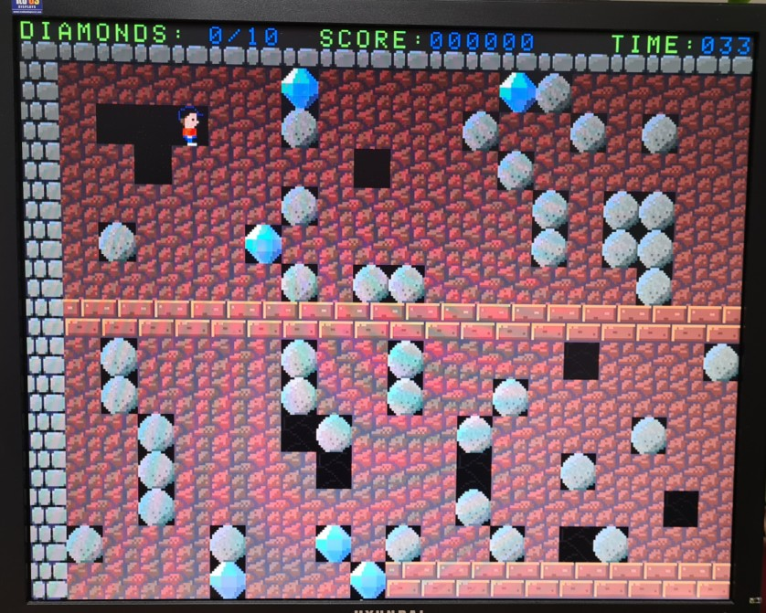
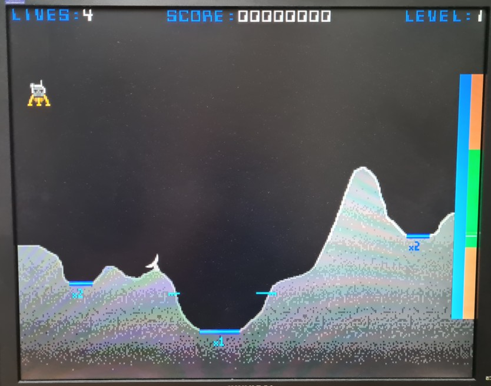
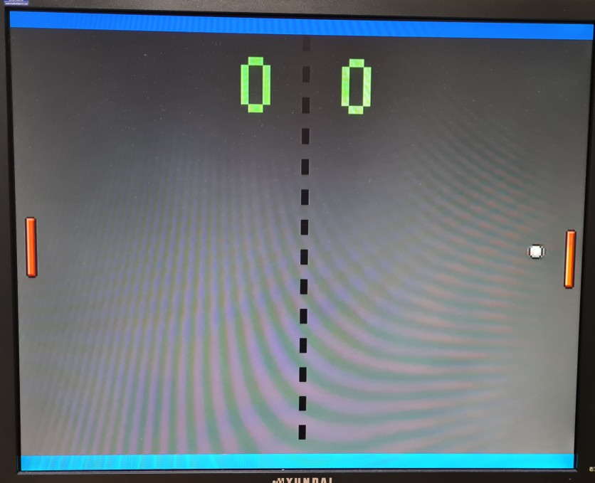
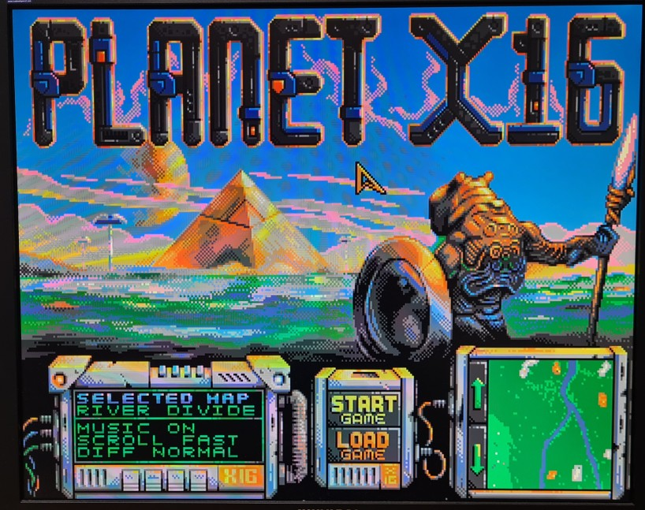
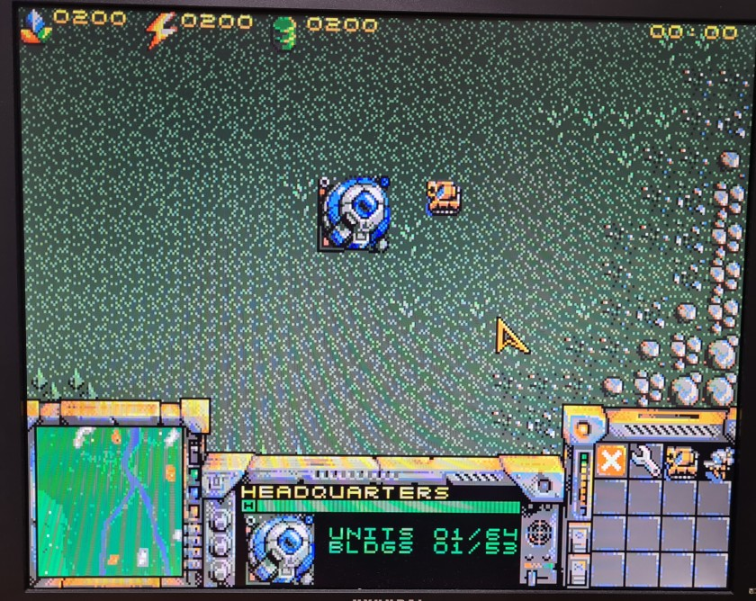

X65
====

The X65 is an ultimate computer for everyone interested in the venerable 65-series of 8-bit and 16-bit CPUs,
i.e. the 6502 and 65816. Specifically, we support the W65C02S and W65C816S CPU chips from Western Design Centre.
The design is fully open-source and open-hardware, and we also prefer to use just the open-source development tools
whenever possible. The X65 computer hardware is designed with modern electronics parts, but with a distinct retro feel.
The computer is backward compatible with Commander X16 (i.e. can run their ROM), but the goal is to improve
both the architecture, performance and elegance of the system.

Compared with modern powerful platforms like x86, ARM or RISC-V, the small 65-series 8-bit system has the advantage
that a person, a software programmer or electronics designer, can fully comprehend the whole system top-down
and bottom-up with all details. There are not many abstraction layers or silos hidden in supporting libraries
or big frameworks. (In fact, there are none. It is just bare metal.) 
The X65 is built for developers who may wish an escape from modern ivory computing towers and who long
for simpler times, maybe faintly remembered from their childhood, playing with commodores, amigas and spectrums.

_Interfaces_: VGA 640x480 out, Stereo sound out (FM and PSG), PS/2 keyboard and mouse, SNES controller 2x ports,
Ethernet LAN 10/100Mpbs with RJ45, SDHC card slot, power-in 5V USB-C port, In-Circuit Debugger (ICD) over the USB-C with 
PC host software in Python and supporting JTAG-like functions for the 65xx platform (CPU step, trace, memory dump & poke).

Project web pages: http://www.x65.eu  -> currently links to http://www.jsykora.info

3D-render of the *Single-Board Computer* version:

General Project Features:
-------------------------

* The CPU is W65C02 (8-bit) or the W65C816 (16-bit; default). The motherboard PCB supports both assembly options.
* Backward software compatibility with the [Commander X16](https://www.commanderx16.com/) computer.
  Can run unmodified CX16 ROM for testing purposes.
* Designed with components (chips) that are in production and available from normal electronics parts distributors in 2024,
  such as Mouser, Farnell, Digikey etc. We avoid obsolete parts.
* Balanced modern/retro design built around the central 65xx CPU supported by semi-ASICs (FPGAs) for system control (NORA),
  video (VERA) and audio (AURA) generation. The FPGAs are the little ones from the iCE40 series, and coded in verilog.
  These are modern takes on the "old masters'" designs with ULA, VIA, SID etc.
  There is no hidden ARM or RISC-V doing heavy lifting in the background.
* Free and open-source design. DIY and hobby-builders friendly. 
  Low-cost to build even in small quantities by individual hackers.

Block Diagram
---------------

Hardware Specification:
------------------------

* **CPU**: [W65C02 or W65C816](doc/cpu02vs816.md) in the QFP-44 package, running at 8MHz, supplied by 3.3V.
* **Memory**: 2MB asynchronous SRAM, common for ROM and RAM.
* **System controller** semi-ASIC, aka north-bridge, aka NORA: Lattice FPGA iCE40HX4K (TQFP-144) handles address decoding, 
  glue logic, PS/2 interfaces, in-circuit debugger and more. 
  "NORA" stands for NORth Adapter, has a similar function like the north bridge in a PC/X86 architecture.
  NORA takes care of the [memory address map](doc/mem-map.md) and hosts most of the [IO registers](doc/ioregs.md).
* Two ports for **SNES-style controllers**, handled by NORA.
* Two **PS/2 ports** for keyboard and mouse, handled by NORA. (note: we reimplement CX16 arduino code in pure hardware logic in verilog.)
* **Colour video** output through VGA connector, up to 640x480 pixels. 
  Generated by [VERA FPGA](https://github.com/X16Community/vera-module): the Video Embedded Retro Adapter, in Lattice FPGA iCE40UP5K. 
  The same is used in Commander X16.
* **Stereo audio** output through 3.5mm jack port. 
  Sound comes from two sources: FM-synthesis (OPM) by YM2151 clone [IKAOPM](https://github.com/ika-musume/IKAOPM) 
  implemented in [AURA FPGA](doc/aura_ym2151.md) (iCE40UP5K),
  and Programmable Sound Generator (PSG) available in VERA FPGA. These are digitally mixed in AURA and passed to a DAC.
  Besides the output jack connector, the sound can be also heard from a small on-board mono speaker.
* **SD-card slot** supporting SDHC cards (handled by VERA FPGA).
* **LAN 10/100Mbps** Ethernet port (RJ45) implemented by [Wiznet W6100](https://www.wiznet.io/product-item/w6100/) chip, 
  with hardware-integrated TCP/IP v4/v6 stack.
* **Real-time clock** (RTC) chip with battery backup.
* [**In-circuit debugger**](doc/icd.md) (ICD) integrated with NORA and accessible over the device USB-C port from a host PC
  running Linux or Windows. The ICD can write all permanent (SPI-Flash) memories in the system, 
  even in a totally empty / bricked state. PC host software is written in Python and should be portable to other 
  fruitful systems besides Linux and Windows.
  Together with NORA the ICD supports JTAG-like functions like memory poke/dump, CPU stop/step, instruction
  trace buffer, interrupt forcing/blocking etc.
* **Power input** 5V from a standard USB Type-C device port.
  The X65 computer can be powered from a normal host-PC USB port (for development with ICD), 
  or runs standalone from a common Mains/USB phone charger with just 5V output.
* Single-board PCB 180x100mm, 4-layers.

Hardware Photos:
----------------

Overview photos (2024/02) - Single-Board version:

**SBC Front view photo**:

**SBC Rear view photo**:

**SBC Top view with labels**:

Engineering testing samples, hand-assembled:

Demo Software Screen Photos
----------------------------

Running Commander X16 ROM and BASIC program (compatibility testing only, not allowed in production use due to a proprietary license):

**BAD METAL** demo from CX16:

**CALLIOPE** music player from CX16:

**Crazy Boulders**, a CX16 game by Dušan Štrakl:

**Crazy Lander**, a CX16 game by Dušan Štrakl:

**Crazy Pong**, a CX16 game by Dušan Štrakl:

**Planet X16**, a CX16 game by David Murray:

Structure of the GIT repository:
---------------------------------

* `doc' --> documentation
* `fpga-aura' --> verilog code for the AURA FPGA (Audio) with referenced IKAOPM sources.
* `fpga-nora' --> verilog code for the NORA FPGA on the motherboard.
* `fpga-vera' --> VERA FPGA bitstream (100% derived from https://github.com/fvdhoef/vera-module)
* `pcb' --> hardware projects in Kicad:
  - `mobo-rev01' --> Motherboard rev01
  - `vabo-rev01' --> Video/Audio board rev01
* `x65prog' --> linux software to program the on-board SPI flash memories from a host Linux PC via the USB link.
* `x65pyhost' --> python scripts for accessing/debugging the X65 from a host PC via the USB link.

Schematics in PDF:
------------------

**SBC Revision A1:**

* [X65-SBC, revA1 - PDF scm](pcb/x65-sbc-revA1/x65-sbc-revA1.pdf)

Software:
-----------

The X65 is software-backwards-compatible with the Commander X16. 
It means the X65 could run unmodified CX16 ROM and programs, excluding programs depending on some of the hardware features 
in CX16 that are not supported here: cartridges, Commodore IEC port.
However, the CX16 ROM is a **proprietary**, non-open-source and non-free, piece of software created by Commodore
and licensed to the CX16 creators. *The licensees do not wish that the ROM runs on other HW than their own.*
Therefore, I could not recommend running that ROM on the X65 computer.

Presently I am decided which operating system or runtime shell would be the best / easiest to port to X65.
There some existing systems that could be ported here, for example:

* [MEGA65 OPEN-ROMs](https://github.com/MEGA65/open-roms) (true free open-source sw),
* [FastBasic](https://github.com/dmsc/fastbasic)
* [GeckOS](http://www.6502.org/users/andre/osa/index.html)

Motivation
------------

This project started in March 2023 when I saw a prototype of Commander X16 in one of the youtube videos
of the 8-bit guy. I immediately wanted to play with it but at the time his project was not released,
the hardware could not be bought. So I decided to build one myself, based on public information available
about the CX16. At the same time I was not too pleased with the architecture and implementation
of the CX16, not satisfied with many design choices they did. 
Consequently, my X65 tries to improve in many areas while being software-compatible.

Contact
--------

**Jaroslav Sýkora**

    Personal: http://www.jsykora.info,
    GIT: https://github.com/jsyk,
    Mastodon: https://oldbytes.space/@jarda,
    Physically in the Czech Republic.
