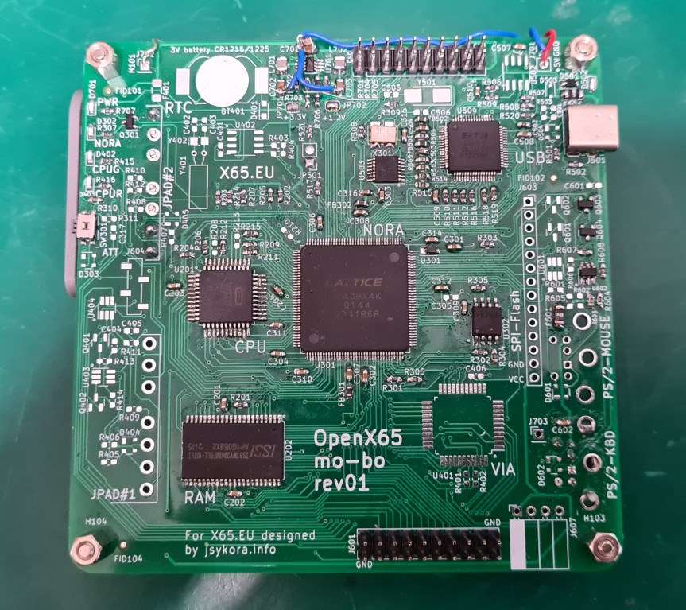
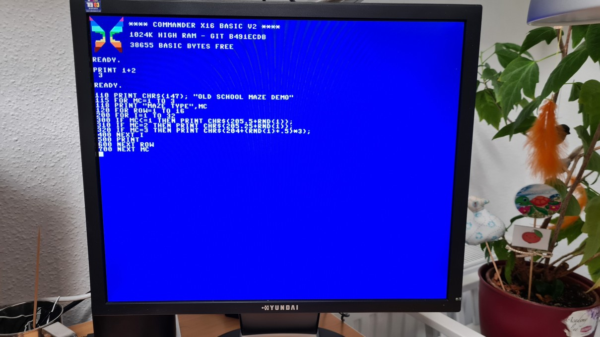
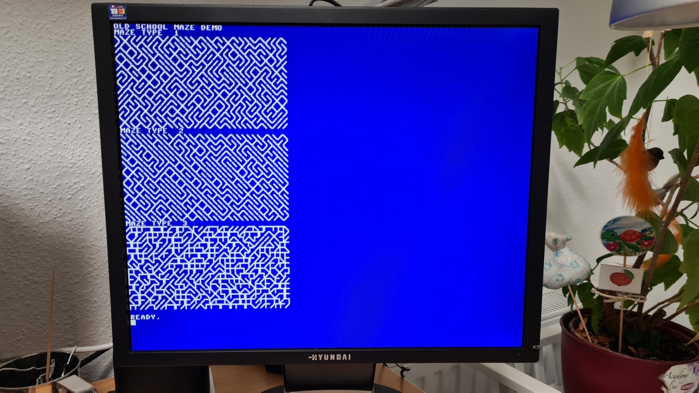

Open-X65
=========

The 65c02 and 65c816-based modern retro computer.

----------------------------------------------------------------------------

*STOP* *STOP* *STOP* *STOP* *STOP* *STOP* *STOP* *STOP* *STOP* *STOP* *STOP* 

Stop, read and think:

THIS HARDWARE PROJECT IS A WORK-IN-PROGRESS!

Some parts are untested yet, and some parts may even contain known bugs 
THAT ARE INTENTIONALLY NOT FIXED IN THE SCHEMATIC OR THE PCB LAYOUT!
(Explanation: as soon a schematic+layout revision gets produced in a fab,
the document must never change. Changes are allowed only in new revisions!)

... YOU HAVE BEEN WARNED ...

*STOP* *STOP* *STOP* *STOP* *STOP* *STOP* *STOP* *STOP* *STOP* *STOP* *STOP* 

----------------------------------------------------------------------------

Features:
----------

* use W65C02 and (optionally) W65C816 (the 16-bit version) CPU.
* software compatibility with the Commander X16: a modern retro computer, developped by the 8-bit Guy.
* use only parts that are in production and readily available from normal distributors such as Mouser, Farnell etc.
* no cheating by using a hidden powerful ARM processor that does some heavy lifting
* open-source design as much as possible
* low-cost as much as possible
* DIY and hobby-builders friendly 

The current architecture:
--------------------------
* two-PCB construction: Motherboard (mo-bo) and Video-Audio board (va-bo), each board will be 100x100mm and 2-layers. This has several advantages:
  * the PCBs can be placed inside Eurocard housings
  * 100x100mm / 2-layers is cheaply manufactured by many PCB vendors

The motherboard (*mo-bo*) PCB has (rev01):
* CPU: W65C02 in the QFP-44 package
* Memory: 2MB asynchronous SRAM
* Lattice FPGA iCE40HX4K (TQFP-144) to handle address decoding, glue logic, PS/2 interfaces. The FPGA design will be called "NORA" = NORth Adapter, because it works as traditional north bridge in a PC. This FPGA has a fully open-source toolchain developed by the icestorm project.
* two ports for SNES controllers, connected to VIA
* two PS/2 ports for keyboard and mouse, handled by NORA
* RTC chip with backup battery
* integrated debug support in the form of FTDI USB / UART+SPI chip
* power input: 5V via USB-C port

The video-audio (*va-bo*) PCB has (rev01):
* video interface from the Commander X16, which is Lattice FPGA iCE40UP5K called "VERA" (Video Embedded Retro Adapter)
* VGA and S-Video video output ports as in the VERA design.
* SD-card slot handled by VERA
* audio FPGA called "AURA" (ICE5LP2K-SG48) that should implement the Yamaha FM synthesizer YM2151 probably using the jt51 project.
* 10/100Mbps Ethernet port RJ45 realized by Wiznet W6100.

Photos:
--------

Overview photos (2023-05-08):

Running X16 ROM and BASIC program:

