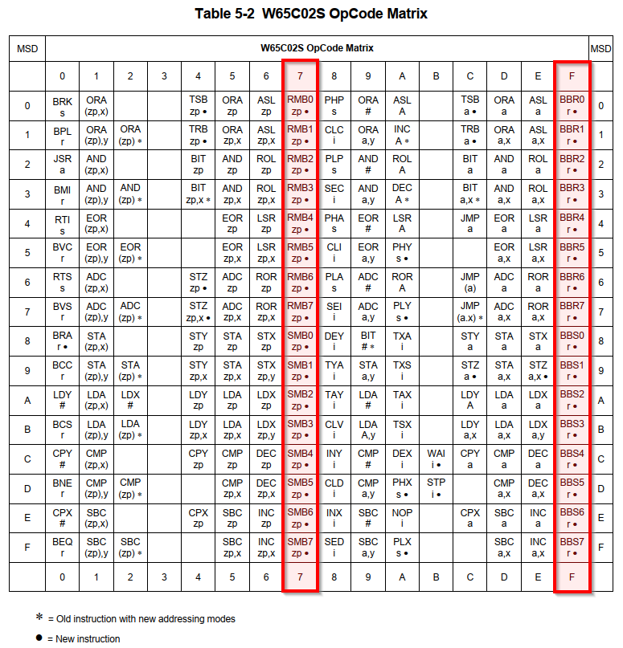

ISAFIX-816
==============

Regarding the Instruction Set Architecture (ISA), 32 instructions are different between the 6502 and 65816 processors.
The following two tables, copied from datasheets of the processors, highlight them.
They are in the column 7 and F, i.e. the problematic instructions have the op-code x7 and xF, where x is 0..F.

The problematic instructions (from the 65C816 point of view) are the following 65C02 instructions:
* RMB0..RMB7 zp = Reset Memory Bit in zero-page
* SMB0..SMB7 zp = Set Memory Bit in zero-page
* BBR0..BBR7 zp, rr = Branch on Bit Set in zero-page to relative address
* BBS0..BBS7 zp, rr = Branch on Bit Reset in zero-page to relative address

If 65C816 (in the Emulation Mode) should run a program originally written for 65C02, these instructions must be replaced
with an alternative code. 

Replace:

    RMBn/SMBn   zp              ; ?7 zp

With:

    NOP                         ; EA; skip over bad instruction
    NOP                         ; EA; skip over its operand; catch zp from memory

and make changes to "(zp)" in NORA behind the scene.

Replace:

    BBRn/BBSn   zp, rr               ; ?F zp rr

With:

    NOP                         ; EA; skip over bad instruction
    NOP                         ; EA; skip over its operand; catch zp from memory
                                ; NORA checks if interested bit is 0/1 in the zp, if the branch would be taken/not-taken.

If 6502 would not-take the branch, then we just need to skip the rr byte and we will be on correct path.
Therefore, force:

    NOP                         ; EA; skip over the rr operand.

On the other hand, if 6502 *would* take the branch, then force instruction

    BRA     .                   ; 80; tell him to branch, let him pick up the correct rr from next byte and continue.

ALTERNATIVE APPROACH: MAX IN SW
---------------------------------

Detect wrong instruction during S5H.
Generate RDY=LOW (maybe delay S5H by 1cc to ensure good RDY setup).
Then PHY2 falling edge.
Do RDY=HIGH and ABORT=LOW => the CPU should abort the bad instruction and go to the abort handler.
Rest in SW (maybe with HW accel if necessary).

